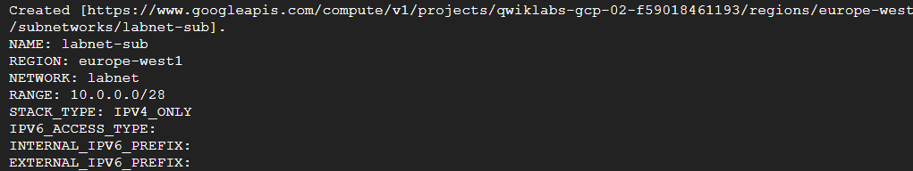

# Create a Virtual Private Cloud
## Tasks
- Conducting research to explore the security of the configuration settings of the new cloud network setup.

## Setup
- Logging in to the account provided by QuickLabs
- Activating Cloud Shell
- Following the steps to complete the task

## Steps
### Listing the Active Account name
> gcloud auth list

### Listing the Project ID
> gcloud config list project

### Creating a Network
> gcloud compute networks create labnet --subnet-mode=custom

### Creating a Subnet
> gcloud compute networks subnets create labnet-sub \
>       --network labnet \
>       --region europe-west1 \ 
>       --range 10.0.0.0/28

### View Networks
> gcloud compute networks list

### List Subnets
> gcloud compute networks subnets list --network=labnet

### Conclusion
Now I am confident in using Cloud Shell and creating a Virtual Private Cloud, along with setting up the subnets.